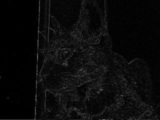
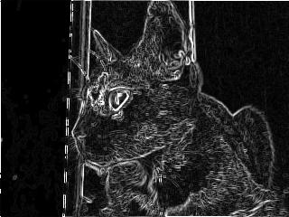

# BORDEX: Detector de borda BMP para coprocessador aritmético de matrizes

**Bordex** é um programa desenvolvido em C para realizar detecção de bordas em imagens bitmap utilizando alguns filtros conhecidos. São eles: Sobel, Laplace, Prewitt e Roberts. O Bordex se utiliza da biblioteca em Assembly Matriks, que facilita a comunicação entre o processador ARM Cortex-A9 (rodando Linux) da plataforma DE1-SoC e um coprocessador aritmético para matrizes implementado na Intel FPGA em Verilog.

O coprocessador que acompanha o programa é capaz de performar operações básicas entre matrizes quadradas de n <= 5 (operações como soma, subtração, multiplicação por escalar ou outra matriz, determinante, oposta...), mas o que é efetivamente utilizado são as duas operações de convolução para aplicação dos filtros de detecção de borda. A biblioteca Matriks possui um conjunto de funções em Assembly que permitem ao usuário enviar dados, realizar operações e receber os resultados por meio de um mapeamento de memória. Já o programa Bordex permite o usuário escolher entre algumas imagens no diretório base e aplicar filtros a ela.

Para obter mais informações exclusivamente sobre o coprocessador aritmético, acesse o [repositório](https://github.com/riancmd/matrix-coprocessor-arm-cortex-a9).
Para a biblioteca Matriks, acesse o [repositório](https://github.com/riancmd/matrix-coprocessor-arm-cortex-a9-2.0).

## 🚀 Sumário

* [Sobre o programa](#-sobre-o-programa)
* [Pré-requisitos](#-pré-requisitos)
* [Como instalar?](#-como-instalar)
* [Recursos utilizados](#-recursos-utilizados)
* [Metodologia](#-metodologia)
  * [Módulos de convolução no coprocessador](#-modulos-de-convolução-no-coprocessador)
  * [Pré-processamento de imagem](#-pre-processamento-de-imagem)
  * [Integração com a biblioteca](#-integracao-com-a-biblioteca)
  * [Programa principal](#-programa-principal)
* [Testes](#testes)
* [Conclusão](#conclusão)
* [Referências](#-referências)
* [Colaboradores](#-colaboradores)

## 👨‍💻 Sobre o coprocessador
Para utilizar o programa Bordex, é necessário ter o coprocessador aritmético para matrizes implementado na FPGA do kit DE1-SoC e a biblioteca Matriks em Assembly. Caso contrário, não será possível utilizar o Bordex, pois ele depende de ambos para processamento das instruções.

O [coprocessador aritmético de matrizes](https://github.com/riancmd/matrix-coprocessor-arm-cortex-a9), desenvolvido para trabalhar em conjunto com o processador ARM Cortex A9, foi implementado em Verilog e possui toda sua documentação disponível no repositório linkado. Entretanto, junto a este repositório, há uma versão atualizada do coprocessador para trabalhar em conjunto com o programa, o que inclui os novos módulos e instruções de convolução. Portanto, **o programa deve ser usadao junto à nova versão do coprocessador**. A versão 3.0 do coprocessador possui modificações para conserto de alguns bugs, além da adição de novos módulos para a convolução (na aplicação de filtros), essencial para o Bordex.

## 📄 Pré-requisitos
Para que o projeto funcione corretamente, é necessário que você tenha:

- Um **kit de desenvolvimento DE1-SoC** com FPGA Cyclone V.
- O software **Quartus Prime Lite Edition 23.1.1** instalado no seu computador.
- Uma distribui **Linux instalado e funcional no HPS** (Hard Processor System) do kit DE1-SoC.
- Conexão entre o HPS e o computador via **cabo Ethernet**.
- O **compilador GCC** já instalado no Linux do HPS (geralmente vem por padrão).

> ⚠️ Estes requisitos **devem** ser seguidos. O projeto foi desenvolvido exclusivamente para o kit DE1-SoC, cuja pinagem e arquitetura são específicas. Ele **não funciona** com outros kits ou configurações diferentes.

## 🔧 Como instalar?
### 1. Preparar o projeto

- Faça o download do projeto como arquivo `.zip` no GitHub.
- Extraia a pasta `matrix-coprocessor-arm-cortex-a9-3.0`.

### 2. Compilar no Quartus Prime

- Abra o **Quartus Prime Lite Edition**.
- Vá em **File > Open Project**.
- Navegue até a pasta extraída do projeto, no subdiretório `matrix-coprocessor-arm-cortex-a9-3.0`.
- Selecione o arquivo `soc_system.qpf` e clique em **Abrir**.
- Clique na **seta azul para a direita** ou vá em **Processing > Start Compilation** para iniciar a compilação.
- Após a compilação, vá em **Tools > Programmer**.
- Clique em **Hardware Setup** e verifique se a placa foi reconhecida.
- Carregue o arquivo `.sof` gerado.
- Clique em **Start** para programar a FPGA.

### 3. Conectar ao HPS via SSH

- Conecte o HPS ao seu computador via **cabo Ethernet**.
- Verifique o IP da placa (disponível na sua placa).
- Abra o terminal no seu computador.
- Utilize o comando SSH para acessar o HPS:
  - `ssh <seu_usuario>@<ip_do_hps>`

### 4. Transferir os arquivos para o HPS
- Abra o subdiretório `bordex` no diretório raiz extraído.
- Certifique-se de que a pasta `src` (com `bordex2.c` e `makefile`) e a pasta `lib` estão organizadas corretamente.
- Use um dos métodos abaixo para transferir os arquivos para o HPS:

#### Opção 1: Pelo terminal (Linux/macOS/WSL)

- Acesse o terminal no seu computador.
- Use o comando `scp` para copiar os arquivos:
  - `scp -r src lib <seu_usuario>@<ip_do_hps>:~/`

#### Opção 2: Pelo gerenciador de arquivos

- No **Linux**:
  - Abra o gerenciador de arquivos.
  - Acesse `sftp://<seu_usuario>@<ip_do_hps>` e copie os arquivos.
- No **Windows**:
  - Use programas como **WinSCP** ou **FileZilla** para realizar a transferência via SFTP.

### 5. Compilar e rodar no HPS

- Acesse o terminal do HPS via SSH.
- Navegue até a pasta `src` onde está o `makefile`.
- Compile o projeto com o comando `make compile`.
- Execute o programa com o comando `make run`.
- Siga as instruções do terminal para escolher a operação, o tamanho da matriz e digitar seus elementos.

## 📦 Recursos utilizados
### 🧩 Placa DE1-SoC

A placa DE1-SoC, baseada no SoC Cyclone V, integra um sistema de processador (HPS) com uma FPGA, permitindo projetos embarcados que combinam software e hardware dedicados.

[Manual da placa - Intel](https://www.intel.com/content/www/us/en/developer/articles/technical/fpga-academic-boards.html)

### 🛠️ Quartus Prime Lite (versões 20.1 e 23.1)

Ferramenta oficial da Intel para desenvolvimento com FPGAs. Permite a criação de circuitos digitais usando linguagens como Verilog e VHDL, com suporte a simulação, análise e programação das placas.

[Site Oficial do Software](https://www.intel.com.br/content/www/br/pt/products/details/fpga/development-tools/quartus-prime.html)

### 🐧 DE1-SoC-UP Linux

O sistema operacional DE1-SoC-UP Linux é a distribuição específica do HPS da DE1-SoC, responsável por rodar o programa que interage com o coprocessador implementado na FPGA através da biblioteca Assembly.

### 👨‍💻 IDE VSCode

Editor de código-fonte gratuito e multiplataforma desenvolvido pela Microsoft. Oferece suporte a diversas linguagens de programação, sistema de extensões robusto, terminal integrado, controle de versão Git nativo e recursos avançados como depuração e refatoração de código.

[Site Oficial do Software](https://code.visualstudio.com/)

---

## 🔨 Metodologia
A atualização do projeto consistiu em realizar 3 etapas básicas: I - Criação dos módulos de convolução no coprocessador para aplicação dos filtros de detecção de borda; II - Criação do código para pré-processamento da imagem em C; III - Programa Bordex para envio dos kernels dos filtros e tratamento final da imagem.

## 🖼️ Módulos de convolução no coprocessador
Para entender os módulos de convolução é necessário entender do que se trata a **convolução**: o que é, como aplicar e para que serve. Basicamente, a convolução, especificamente se tratando de operações com matrizes, é um processo matemático envolvendo 2 matrizes, as quais são **multiplicadas**, porém, diferentemente da usual multiplicação de matrizes conhecida e que já existe como operação dentro do coprocessador - onde linha é multiplicada por coluna - nesse tipo de operação multiplica-se **cada elemento** da matriz A pelo elemento **correspondente** da matriz B, e então tem-se uma matriz C resultado desse processo para cada elemento multiplicado. Após isso, **soma-se** cada elemento dessa matriz C entre si, e tem-se um valor final. Dentro da lógica de manipulação de imagens, onde uma imagem é interpretada como uma matriz de pixels, onde cada pixel possui 24 bits representando seu valor RGB - 8 bits para cor vermelha(red), 8 para cor verde(green) e 8 para cor azul(blue) - ou 8 bits caso for imagem em tons de branco e preto, aplica-se cada pixel dentro de uma matriz A com os pixels ao redor da principal uma matriz B chamada **filtro** ou ***kernel*** para reealizar a convolução, com isso terá novos valores para cada pixel. A depender do tipo de filtro aplicado, esse valor pode ser usada diretamente ou precisa ainda tirar seu módulo. 

O objetivo desse processo é aplicar efeitos em uma imagem para gerar uma nova com as características requisitadas pelo efeito, como detecção de borda, aplicar foques ou desfoques, entre outros. Para o projeto, serão usados filtros para detecção de bordas de imagens, onde é necessário aplicar 2 filtros para cada pixel para Sobel, Roberts e Prewitt, sendo um filtro levando em conta a leitura no eixo x, esquerda para direita, e um para o eixo y, cima para baixo, e então os valores para cada eixo são combinados em módulo (raiz quadrada da soma dos quadrados de cada eixo), enquanto para o Laplace, pega-se apenas o valor gerado em um eixo.

Uma vez contextualizado sobre a ***convolução***, o próxmio passo foi criar os módulos em *verilog*. Foram criados 2 novos módulos e, portanto, 2 novos opcodes.
- **Convolution_trans**: aplicado para os filtros Sobel, Prewitt e Laplace, recebendo as 2 matrizes, sempre considerando 5x5 e então aplica o método de convolução, contudo, para os filtros de Sobel e Prewitt, o kernel de um eixo que entra como matriz B pode ser transposto para gerar o kernel no outro eixo, assim pode-se apanas enviar um filtro e **paralelamente** são gerados os 2 valores. Para Laplace, são enviados os 2 valores, contudo a transposta de um kernel é igual ao kernel o outro eixo, logo são enviados ao HPS 2 valores iguais.
- **Convolution_roberts**: para o filtro de Roberts não é possivel aplicar a transposta para achar a matriz do outro eixo, porém o outro kernel é ainda é possível de ser achado apenas trocando a posição dos elementos dentro de uma mesma linha da matriz 2x2 enviada, assim é ainda possível gerar 2 valores de forma **paralela**.

Ademais, dentro de cada módulo, o processo de convolução é dividido em 2 partes: 1 - multiplicação dos elementos, 2 - soma dos elementos:
- 1 - Primeiro para cada par de elemento correspondente, é aplicado a multiplicação de forma combinacional, ou seja, sempre que há mudanças nos valores, isso é propagado quase instantaneamente para os registradores que armazenam os valores da multiplicação. Como são matrizes 5x5, há 50 registradores de 16 bits para acomodar o resultado desse primeiro processo, 25 para a multiplicação considerando o eixo x e 25 registradores para o eixo transposto.
- 2 - Após isso, os valores são somados e armazenados em um registrador de 20 bits, um registrador para cada eixo. Todavia, não possível somar 25 registradores ao mesmo tempo, sendo necessário, portanto, usar uma **máquina de estados finitos** para aplicar a soma sequencialmente. Nessa máquina, quando a operação é iniciada, um contador inicia e são somados 3 registradores - 4 registradores resultam em uma soma incorreta - por vez até chegar no 25º registrador. Uma vez somado todos os valores, o próximo estado é o de **Done**, no qual verifica-se se o valor da soma gerado é maior que 127 ou menor que -128, caso seja, o valor a ser enviado é então ***saturado***, uma operação que faz o valor resultando ser igual a 11111111 em binário. Caso não seja esteja fora desse intervalo, os 2 valores são armazenados no registrador de resultados do coprocessador pronto para ser carregado para o HPS.

> ⚠️ Observação: Para o *convolution_roberts* o contador apenas conta 2 somas, uma vez que como interpreta-se apenas matrizes 2x2, ele realiza apenas 4 multiplicações, sendo somado 3 desses 4 valores em um ciclo de clock e o outro valor é somado ao acumlador em outro ciclo para então ir pro estado de *Done*.

A nova tabelade ***opcodes*** e seus comportamentos podem ser vistos a seguir:
| **OPCODE** | **Operação**                | **Números A e B**                                   | **Tamanho da Matriz**                                                             | **Posição**                                                | **Funcionalidade**                                                                                  |
|------------|-----------------------------|-----------------------------------------------------|------------------------------------------------------------------------------------|-------------------------------------------------------------|------------------------------------------------------------------------------------------------------|
| `0000`     | Soma                        | Não usa esse campo                                  | Não usa esse campo                                                                 | Não usa esse campo                                           | Soma de duas matrizes                                                                                |
| `0001`     | Subtração                   | Não usa esse campo                                  | Não usa esse campo                                                                 | Não usa esse campo                                           | Subtrai matriz A da matriz B                                                                        |
| `0010`     | Multiplicação de matrizes   | Não usa esse campo                                  | Não usa esse campo                                                                 | Não usa esse campo                                           | Multiplica matrizes A e B                                                                           |
| `0011`     | Multiplicação por inteiro   | Não usa esse campo                                  | Não usa esse campo                                                                 | Não usa esse campo                                           | Multiplica matriz A por um inteiro                                                                  |
| `0100`     | Determinante                | Não usa esse campo                                  | Usa para decidir qual determinante usar (Det2x2, Det3x3, Det4x4 ou Det5x5)         | Não usa esse campo                                           | Calcula a determinante da matriz com base no tamanho                                                |
| `0101`     | Transposta                  | Não usa esse campo                                  | Não usa esse campo                                                                 | Não usa esse campo                                           | Calcula transposta da matriz A                                                                      |
| `0110`     | Oposta                      | Não usa esse campo                                  | Não usa esse campo                                                                 | Não usa esse campo                                           | Calcula oposta da matriz A                                                                          |
| `0111`     | Store_matrix1               | Usa para guardar 2 valores                          | Não usa esse campo                                                                 | Usado para guardar os números em certo offset do buffer/registrador     | Salva os 2 números no campo da instrução em certo offset dado pelo campo da posição dentro do registrador da matriz A |
| `1000`     | Store_matrix2               | Usa para guardar 2 valores                          | Não usa esse campo                                                                 | Usado para guardar os números em certo offset do buffer/registrador     | Salva os 2 números no campo da instrução em certo offset dado pelo campo da posição dentro do registrador da matriz B |
| `1001`     | Load_matrixR                | Não usa esse campo                                  | Não usa esse campo                                                                 | Usado para ler os bits armazenados no buffer/registrador com base no offset da posição       | Retorna para HPS 32 bits presentes no registrador de resultado com base no offset dado pelo campo da posição          |
| `1010`     | Convolução com transposição | Não usa esse campo                                  | Não usa esse campo                                                                 | Não usa esse campo                                           | Aplica operação de convolução para filtros Sobel, Prewitt e Laplace usando transposição para encontrar o kernel do outro eixo |
| `1011`     | Convolução para Roberts     | Não usa esse campo                                  | Não usa esse campo                                                                 | Não usa esse campo                                           | Aplica convolução para filtro Roberts, encontrando o kernel do outro eixo por troca de posição entre elementos de uma mesma linha |

### 📍 Ponto de interesse
Como foi usado uma soma de **3 registradores** a cada ciclo por vez (**máximo** de operadores em uma única soma encontrado) e os processos de convolução para kernel do eixo X e kernel do eixo Y foram feitos em **paralelo**, isso culminou em um tempo muito otimizado de processamento da imagem inteira: o tempo visto para detectar as bordads de uma imagem .bmp de tamanho 320x240 foi de **3.2 segundos** no início do projeto. Nos ajustes **finais** do projeto, o tempo de execução foi reduzido ainda mais gerando uma espera em um intervalo de **1.8 - 2.2 segundos**. 
Portanto, um dos **melhores** benefícios do projeto como um todo é seu **ágil** tempo de aplicação de filtro, que permitiu, inclusive, testes em laboratório mais rápidos e em maior quantidade já que a espera entre testes é curta.

## 🤳 Pré-processamento de imagem
Este código implementa um sistema de pré-processamento para imagens BMP que trabalha com a estrutura específica desse formato de arquivo. Uma imagem BMP é organizada em duas partes principais: o cabeçalho (que contém informações como dimensões, profundidade de cor e offset) e os dados dos pixels propriamente ditos. O código utiliza uma struct (`img`) para armazenar todos esses metadados, fazendo a leitura completa do arquivo e extraindo as informações essenciais do cabeçalho. A conversão para escala de cinza ocorre nessa parte e é essencial para a aplicação dos filtros. Ela funciona da seguinte forma: como cada pixel colorido possui três canais (vermelho, verde e azul), o código calcula a média desses três valores e aplica esse resultado nos três canais simultaneamente. Quando os três canais RGB têm o mesmo valor, o resultado visual é uma tonalidade de cinza, preparando perfeitamente a imagem para algoritmos de detecção de bordas que trabalham melhor com informações apenas de luminosidade.

O desenvolvimento seguiu lidando com algumas peculiaridades do formato BMP, como o fato de que os dados dos pixels ficam separados do cabeçalho por um offset específico, e o sistema de padding que alinha cada linha em múltiplos de 4 bytes para otimização de memória. Apenas depois foi criada a struct que facilita o processo, numa refatoração do código. Outro detalhe importante é que as imagens BMP armazenam as linhas de forma invertida (de baixo para cima), então o código precisa considerar isso ao processar os pixels. A conversão para escala de cinza foi implementada de forma eficiente, percorrendo cada pixel e aplicando a transformação diretamente nos dados originais, economizando memória e deixando tudo pronto para os filtros de detecção de bordas.

## 📚 Integração com a biblioteca
A biblioteca `Matriks` foi escrita em Assembly para ARMv7 e serve como interface entre o processador (HPS) da DE1-SoC e o coprocessador de operações com matrizes implementado em Verilog na FPGA . Ela foi projetada anteriormente para o Projeto versão 2.0. O link desse projeto está a seguir: [matrix-coprocessor-arm-cortex-a9-2.0](https://github.com/riancmd/matrix-coprocessor-arm-cortex-a9-2.0/tree/main)

### 🔧 Como funciona a biblioteca?
A biblioteca realiza, em geral, 6 ações, incluindo: inicializar o mapeamento de memória, enviar instruções, enviar um sinal de início de operação, receber os dados do coprocessador, verificar situações de overflow e desmapear a memória. Abaixo, uma breve descrição de cada etapa:

1. **Inicialização**: Mapeia os registradores da FPGA na memória virtual do Linux, através de `/dev/mem` (utilizando a função start_program).
2. **Envio de dados**: Envia pares de valores inteiros (elementos da matriz ou dados intermediários) para a FPGA.
3. **Início da operação**: Aciona o coprocessador para realizar a operação desejada (soma, subtração, multiplicação, etc.).
4. **Recebimento dos resultados**: Lê os dados processados de volta para o HPS.
5. **Verificação de overflow**: Verifica se houve overflow durante o processamento.
6. **Finalização**: Desfaz o mapeamento de memória e encerra o uso da biblioteca.

A partir das funções listadas a baixo, são então enviados as matrizes de cada pixel e as matrizes dos filtros a partir do *operate_buffer_send*, a operação ocorre através da chamada de  *calculate_matriz*, e obtém-se o resultado com o *operate_buffer_receive* para o eixo X e para o eixo Y para serem manipulados em C - calcular módulo para Sobel, Prewitt e Robets ou o valor absoluto para Laplace. Como as imagens de base são de tamanho 320x240, são enviados 76800 pixels (OBS: Imagens de qualquer tamanho podem ser usadas, desde que sejam no formato ***BITMAP(bmp)***, cada um em uma matriz adequada para a posição do pixel, já para o filtro é enviado apenas uma vez antes de iterar pela imagem, o que resultou em uma diminuição do tempo de processamento da imagem. Antes o tempo era de cerca de 3.2 segundos enviando matriz A e B a cada iteração, com a mudança descrita, o tempo foi reduzido a **incríveis** 2.2 segundos.

---

### 📌 Tabela compacta de funções
| Função                    | Argumentos                          | Bits por Argumento (Total) | Descrição                                                                 |
|---------------------------|-------------------------------------|----------------------------|---------------------------------------------------------------------------|
| `start_program`           | `void`                              | -                          | Inicializa o programa e mapeia os endereços dos PIOs                      |
| `exit_program`            | `void`                              | -                          | Finaliza o programa e desmapeia a memória                                 |
| `operate_buffer_send`     | `(opcode, size, position, matriz)` | **Instrução (32 bits):** - 8 bits N1 - 8 bits N2 - 4 bits Opcode - 2 bits Size - 3 bits Position - 1 bit Start - 6 bits não utilizados | Envia 2 elementos da matriz por vez para o coprocessador                  |
| `calculate_matriz`        | `(opcode, size, position)`         | **Instrução (32 bits):** - 4 bits Opcode - 2 bits Size - 3 bits Position - 1 bit Start - 22 bits não utilizados | Inicia uma operação matricial no coprocessador                            |
| `operate_buffer_receive`  | `(opcode, size, position, matriz)` | **Retorno (32 bits):** - 4 valores de 8 bits cada (total 32 bits)       | Recebe 4 elementos da matriz resultante por vez do coprocessador          |
| `signal_overflow`         | `void`                              | **Sinal (1 bit):** - 1 bit Overflow (bit 0 do PIO3)                    | Verifica se ocorreu overflow na última operação                           |

---

## 🧠 Programa principal
### Bordex
O `Bordex` é o programa principal do projeto, que gerencia as informações da imagem e as solicitações de operações para o coprocessador. Ele implementa os algoritmos de detecção de bordas utilizando o coprocessador aritmético 3.0, oferecendo uma interface simples no próprio terminal para aplicar diferentes filtros em imagens BMP.

### Características
* Suporte a imagens BMP de 24 bits
* Processamento em escala de cinza
* Tratamento automático de bordas da imagem

### Filtros
O Bordex oferece cinco filtros diferentes para detecção de bordas:

* **Sobel 3x3:** Filtro que detecta bordas calculando gradientes nas direções horizontal e vertical
* **Sobel 5x5:** Versão expandida do Sobel com janela maior, oferecendo maior precisão em bordas suaves
* **Prewitt 3x3:** Alternativa ao Sobel com características similares, mas com diferentes coeficientes
* **Roberts 2x2:** Filtro que trata bordas diagonais
* **Laplace 5x5:** Baseado na segunda derivada, detecta bordas independentemente da direção e é bem sensível

### Funções
O programa possui algumas funções relevantes que podem ser utilizadas na main `bordex2.c`, são elas:

`preprocess():` Carrega e prepara a imagem BMP em preto e branco (como explicado anteriormente)

`edgeDet():` Implementa todos os algoritmos de detecção de bordas

`saveImg():` Salva a imagem processada mantendo a compatibilidade BMP

Todas as funções lidam com a struct criada na main. Caso tenha interesse em modificar a main e adicionar uma outra sequência de instruções, é necessário utilizar a ordem correta das funções. Antes de utilizar a detecção de bordas com o `edgeDet()`, é preciso realizar o pré-processamento. Após a detecção de bordas, é preciso salvar a imagem para ver o resultado. Caso queira ver o resultado do pré-processamento, também é preciso salvar a imagem com `saveImg()`.

A struct `img` guarda os metadados da imagem, o que facilita a manipulação e processamento dos dados da mesma.

## 🧪 Testes
Aqui, alguns dos testes realizados utilizando o programa Bordex. Para isso, a imagem "1" na pasta img\sample foi utilizada.

`Filtro de Roberts`

`Filtro de Prewitt`

## ✅ Conclusão
O projeto representou um aplicação interessante do coprocessador aritmético de matrizes, tendo uma implementação bem-sucedida de um sistema de detecção de bordas e enfatizando, no fim das contas, a cooperação entre processamento em software e hardware dedicado. O coprocessador também demonstrou-se rápido, conseguindo processar imagens de 320x240 pixels em aproximadamente 2 segundos, um desempenho notável para a aplicação de filtros complexos como Sobel, Prewitt, Roberts e Laplace.

A arquitetura desenvolvida aproveita as vantagens do processamento paralelo implementado no coprocessador, especialmente na aplicação simultânea dos kernels para os eixos X e Y, resultando em uma otimização significativa do tempo de processamento. Os resultados obtidos confirmam o quão útil o projeto pode ser e, da mesma forma, sugere-se expandir futuramente o sistema, tanto na implementação de novos filtros quanto na introdução de novos componentes no coprocessador que tornem ainda mais eficiente o processamento dos filtros (como um módulo para cálculo de raiz e módulo).

## 📚 Referências
* Patterson, D. A. ; Hennessy, J. L. 2016. Morgan Kaufmann Publishers. Computer organization and design: ARM edition. 5ª edição.

* GEKSFORGEEKS. Co-processor in Computer Architecture. Disponível em: https://www.geeksforgeeks.org/co-processor-computer-architecture/. 

* INTEL CORPORATION. Intel 8087 Numeric Data Processor: User’s Manual. Disponível em: https://datasheets.chipdb.org/Intel/x86/808x/datashts/8087/205835-007.pdf.

* JUNIOR, G. B. Detectando Bordas: Filtros Passa Alta. Disponível em: https://nca.ufma.br/~geraldo/vc/5.bordas.pdf.

## 👥 Colaboradores
* **Rian da Silva Santos** -  [Rian](https://github.com/riancmd)
* **Victor Ariel Matos Menezes** - [Victor](https://github.com/VitrolaVT)
